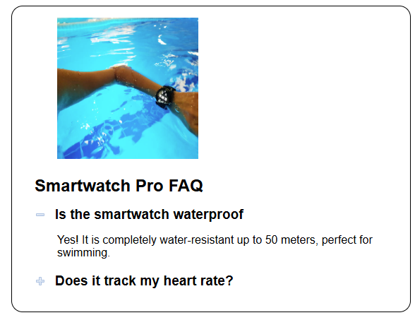
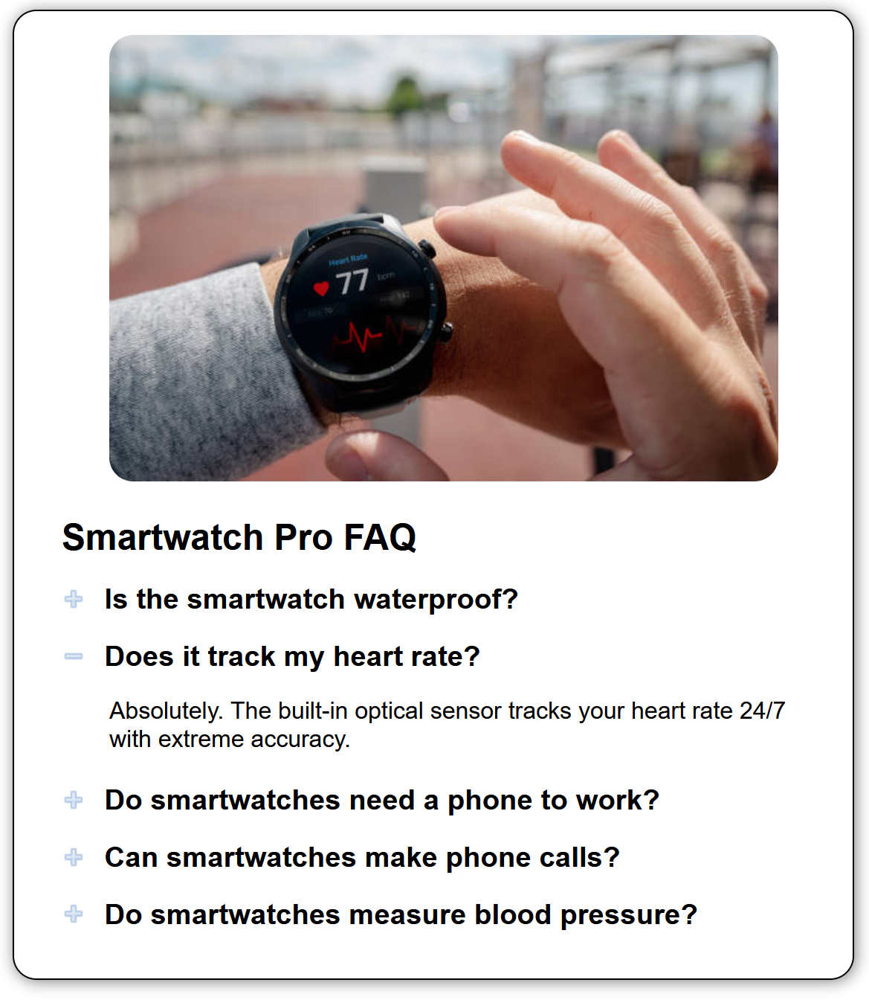

# ⌚ Smartwatch FAQ

---

## 👤 Author
[@bstearns07](https://github.com/bstearns07)  
Ben Stearns

---

## 📑 Table of Contents
- [📌 Summary](#-summary)
- [Live Demo](#-live-demo)
- [✨ Features](#-features)
- [🧰 Tech Stack](#-tech-stack)
- [⚙️ How It Works](#-how-it-works)
- [🧠 Topics Covered](#-topics-covered)
- [📘 What I Learned](#-what-i-learned)
- [🖼 Screenshots](#-screenshots)

---

## 📌 Summary

The **Smartwatch FAQ** application demonstrates how JavaScript can dynamically control UI behavior using DOM manipulation and class-based state management.

This project showcases interactive image swapping, accordion functionality, and clean client-side logic — all built with vanilla JavaScript.

---

## 🚀 Live Demo
[Click Here to Open the Smartwatch FAQ App](https://bstearns07.github.io/SmartwatchFAQ/)

---

## ✨ Features

- Interactive FAQ accordion behavior
- Dynamic image swapping
- Single-answer visibility logic
- Automatic default state restoration
- Clean, modular DOM-based architecture
- Accessibility improvements for Tab order and Enter/Space key support for elements that normally do not receive focus
- CSS responsive design using media query and flexible layout principles
---

## 🧰 Tech Stack

### 🖥 Frontend
- HTML5 (Semantic Markup)
- CSS3 (Layout & Styling)
- Vanilla JavaScript (ES6+)

### 🧩 Core Concepts
- DOM Manipulation
- Event Handling
- ClassList API
- Data Attribute Binding
- Conditional Rendering

### 🛠 Development Tools
- Git & GitHub
- WebStorm

---

## ⚙️ How It Works

1. Open `index.html`
2. Click on any FAQ question to reveal its answer. Alternatively, use Tab and press Enter/Spacebar works as well
3. Selecting a question dynamically swaps the smartwatch image
4. Only one answer can be displayed at a time
5. Collapsing all answers restores the default image

---

## 🧠 Topics Covered

| Category | Concept | Methods / Properties |
|----------|----------|----------------------|
| DOM Manipulation | Caching elements | `document.querySelector()` `document.querySelectorAll()` |
| DOM Manipulation | Attribute access | `element.attributeName` |
| DOM Manipulation | Attribute management | `element.getAttribute()` `element.setAttribute()` |
| DOM Manipulation | Class removal | `element.classList.remove()` |
| DOM Manipulation | Adjacent element traversal | `element.nextElementSibling` |
| UI Behavior | Image swapping / visibility control | `element.classList.toggle()` |

---

## 📘 What I Learned

- You can improve app efficiency by caching DOM elements once on DOM load unless otherwise needed
- Data attributes simplify dynamic content binding
- Class toggling provides clean state management when it comes to features like accordion-style behavior
- Tab order is a great way to improve your application's accessibility
- How to create README tables
- How to host applications using GitHub Pages

---

## 🖼 Screenshots

### 🖼 Default State

### 💧 Waterproof Feature Selected

### ❤️ Heartrate Feature Selected

---

⬆️ [Back to Top](#-smartwatch-faq)