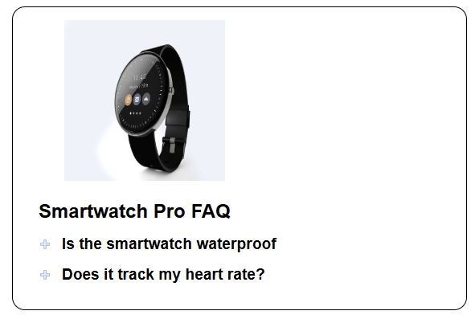

# Smartwatch FAQ

## Author
[@bstearns07](https://github.com/bstearns07) Ben Stearns

## Table of Contents
- [Author](#Author)
- [Summary](#summary)
- [How Does it Work](#how-does-it-work)
- [Topics Covered](#topics-covered)
- [Screenshots](#screenshots)
    - [First Image](#first-image)

## Summary
### Welcome to the SmartwatchFAQ App!

## How Does it Work

## Topics Covered
- DOM manipulation
- Defining functions
- Adding event listeners
- switch(true) statements
- "keydown" event listeners and element.focus() for improved user experience
- Enabling/disabling buttons
- Tailwind responsive design and animations

## Screenshots

### First Image

[Back to Top](#smartwatch-faq)